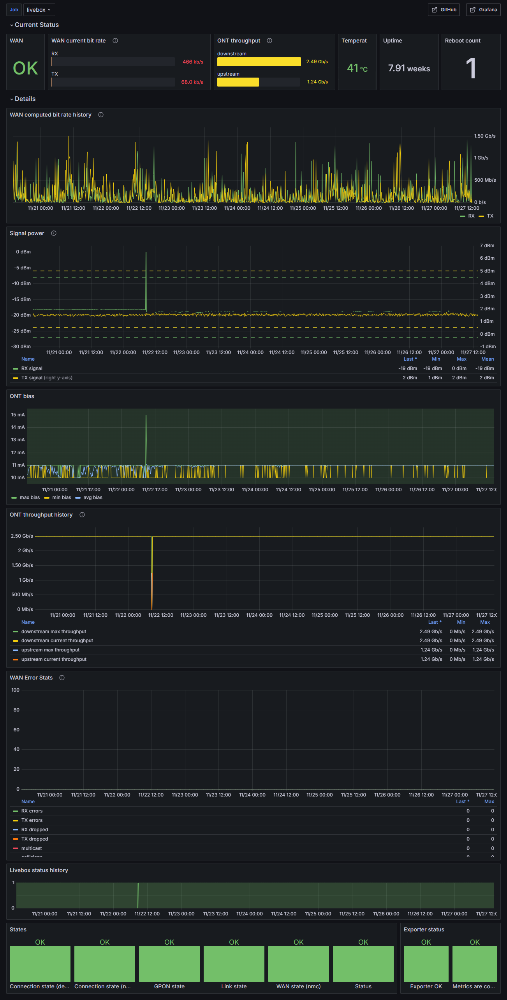

# Livebox Exporter for Prometheus

This project exposes a subset of basic metrics from Orange **Livebox 5** router.
It is meant to be integrated with [Prometheus](https://prometheus.io/docs/instrumenting/exporters/).

Once deployed, endpoint `/metrics` returns a page of [text-based metrics](https://prometheus.io/docs/instrumenting/exposition_formats/#text-based-format/). Default URL will be: `http://localhost:9105/metrics`

Dashboard for Grafana is available here: https://grafana.com/grafana/dashboards/21101-livebox/



## Similar alternatives

This project is designed to run in the background continuously (headless and non interactive), to monitor the WAN connection status. My primarily goal was to measure stability of my Internet access at home.

If you are looking for an interactive desktop application, also with more features, see [Livebox Monitor](https://github.com/p-dor/LiveboxMonitor) which works very well.

## Application settings

If you try to run program with default settings, it may work if you are lucky: Livebox address should be automatically detected if it is on same network (same subnet). 

Without your admin password to authenticate to your Livebox, only a subset of metrics will be available.

As usual, application settings are in file `appsettings.json`, and these settings can be overriden by environment variables.

It's best to configure program with your own settings, especially these keys:

- **Host**: IP address of your Livebox (eg: "192.168.1.1")
- **Password**: password of admin user on your Livebox. Alternatively, you can also set a setting **PasswordFile** with path of a file containing this password.

Port and network interface to listen can be set with setting **urls**. Default is `http://localhost:9105`.

## Run in Kubernetes

Docker image is published on [Docker Hub](https://hub.docker.com/r/eric1901/livebox-exporter).

Examples of resource manifests:

```
apiVersion: v1
kind: Secret
metadata:
  name: livebox-exporter-secret
type: Opaque
stringData:
  admin-password: "YOUR PASSWORD"
---
apiVersion: apps/v1
kind: Deployment
metadata:
  name: livebox-exporter-deployment
  labels:
    app: livebox-exporter
spec:
  replicas: 1
  selector:
    matchLabels:
      app: livebox-exporter
  template:
    metadata:
      labels:
        app: livebox-exporter
    spec:
      volumes:
      - name: secret-volume
        secret:
          secretName: livebox-exporter-secret
      containers:
      - name: livebox-exporter
        image: eric1901/livebox-exporter
        volumeMounts:
        - name: secret-volume
          readOnly: true
          mountPath: "/var/secret/"
        env:
        - name: urls
          value: "http://*:9105"
        - name: Livebox__Host
          value: "192.168.1.1"
        - name: Livebox__PasswordFile
          value: "/var/secret/admin-password"
```

### Create a service

#### Expose API outside Kubernetes cluster

For example, if you simply want to expose this API outside of the Kubernetes cluster, use a `NodePort` service type:

```
apiVersion: v1
kind: Service
metadata:
  name: livebox-exporter-service
  labels:
    app: livebox-exporter
spec:
  type: NodePort
  selector:
    app: livebox-exporter
  ports:
  - name: http
    port: 9105
    protocol: TCP
    targetPort: 9105
    nodePort: 30080
```

The API will be accessible via `http://Your-Kubernetes-Cluster-Ip:30080/metrics`.

#### Expose API inside Kubernetes cluster and use a reverse proxy

Alternatively, if you have a reverse proxy inside another pod on same cluster, use a `ClusterIP` service type:

```
apiVersion: v1
kind: Service
metadata:
  name: livebox-exporter-service
  labels:
    app: livebox-exporter
spec:
  type: ClusterIP
  selector:
    app: livebox-exporter
  ports:
  - name: http
    port: 9105
    protocol: TCP
    targetPort: 9105
```

At home, I use an [nginx as a reverse proxy](https://docs.nginx.com/nginx/admin-guide/basic-functionality/managing-configuration-files/#virtual-servers), with this virtual server configuration inside conventional directory `conf.d` (mounted through a persistent volume claim):

```
server {
    listen 80;
    server_name YOUR-SERVER-NAME;

    location /livebox {
        proxy_pass http://livebox-exporter-service:9105;
        proxy_set_header Host $host;
        proxy_set_header X-Real-IP $remote_addr;
        proxy_set_header X-Forwarded-For $proxy_add_x_forwarded_for;
        proxy_set_header X-Forwarded-Proto $scheme;
        proxy_set_header X-Forwarded-Prefix /livebox;
    }
}
```

My nginx runs inside another pod on same Kubernetes single-node cluster and its port 80 is exposed on a node port 30080 (whithin default exposed port range of my K3S).
So `http://localhost:30080` points to my nginx pod, and any URL starting with prefix `/livebox` is directed to `http://livebox-exporter-service:9105`.

My Prometheus instance runs on same server, but not inside Kubernetes. Then, scrape URL from Prometheus running on same server is: `http://localhost:30080/livebox/metrics`.
